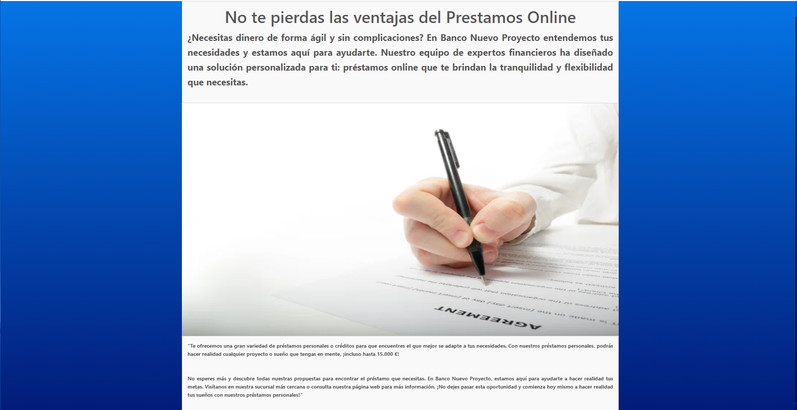

# Proyecto intermodular Pagina XHtml "Banco Nuevo Proyecto"

***

Hemos creado una pagina de inicio ("index.html") en la que al entrar nos econtramos banners un boton de inicio que nos  enviara a una pagina llamada "login.html" y otro hiperenlace a FAQs.
Aqui os dejo un ejemplo de un trozo de codigo de esta pagina con sus respectivos CCS conrrespondiente:


``` html 

<fieldset>
						<div class= "oferta">
						<h2 class="centra">No te pierdas las ventajas del Prestamos Online</h2>
						<p >¿Necesitas dinero de forma ágil y sin complicaciones? En Banco Nuevo Proyecto entendemos 
							tus necesidades y estamos aquí para ayudarte. Nuestro equipo de expertos financieros ha diseñado 
							una solución personalizada para ti: préstamos online que te brindan la tranquilidad y flexibilidad que necesitas.</p>
						</div>
						
						<div class="oferta2">
							<p>"Te ofrecemos una gran variedad de préstamos personales o créditos para que encuentres 
								el que mejor se adapte a tus necesidades. Con nuestros préstamos personales, 
								podrás hacer realidad cualquier proyecto o sueño que tengas en mente, ¡incluso hasta 15.000 €! </p>
								<br/>
								<p>No esperes más y descubre todas nuestras propuestas para encontrar el préstamo que necesitas.
									 En Banco Nuevo Proyecto, estamos aquí para ayudarte a hacer realidad tus metas. Visítanos en nuestra sucursal
									  más cercana o consulta nuestra página web para más información. ¡No dejes pasar esta oportunidad y comienza 
									  hoy mismo a hacer realidad tus sueños con nuestros préstamos personales!"</p>
						</div>

									
</fieldset>
```
``` css

.oferta {
  color: #575555;
  line-height: 1.6;
  font-size: 18px;
  text-align: justify;
  padding: 10px;
  border: 1px solid #dddddd;
  border-radius: 4px;
  background-color: #f9f9f9;
  box-shadow: 0 2px 4px rgba(0, 0, 0, 0.1);

}

.oferta2 {
  color: #575555;
  line-height: 1.6;
  font-size: 10px;
  text-align: justify;
  padding: 10px;
  border: 1px solid #dddddd;
  border-radius: 4px;
  background-color: #f9f9f9;
  box-shadow: 0 2px 4px rgba(0, 0, 0, 0.1);
}

.centra {
  text-align: center;
}

.ampliacion-imagen {

  width: 855px;
  height: 455px;
}
``` 



Una vez entremos en en login veremos un cuadro de inicio de sesion en el que nos pediran DNI y contraseña del contacto , junto con las opciones de inciar sesion y la de crear nuevo usuario.Seguido muestro el codigo que hemos necesitado para hacer el cuadro de inicio de sesion:


``` html 
<div class="login-container">
		<div class="login-content">
			<p class="text-center">
				<i class="fas fa-user-circle fa-5x"></i>
			</p>
			<p class="text-center">
				Inicia sesión con tu cuenta
			</p>
			<form action="">
				<div class="form-group">
					<label for="UserName" class="bmd-label-floating"><i class="fas fa-user-secret"></i> &nbsp; DNI</label>
					<input type="text" class="form-control" id="UserName" name="DNI" pattern="[0-9]{8}[A-Za-z]" maxlength="9">
				</div>
				<div class="form-group">
					<label for="UserPassword" class="bmd-label-floating"><i class="fas fa-key"></i> &nbsp; Contraseña</label>
					<input type="password" class="form-control" id="UserPassword" name="clave" maxlength="200">
				</div>
				<a href="home.html" class="btn-login text-center">INICIO SESION</a>
				<a href="user-new.html" class="btn-login text-center">NUEVO USUARIO</a>

			</form>
		</div>
	</div>
    
``` 


Una vez apretemos el boton de "INICIO SESION" entraremos al home de nuestra pagina web que tendra este aspecto en el cual podremos movernos por un menu lateral o un menu intuitivo de logos :


Os dejo seguidamente como seria una de las interfaces llamada NUEVO PRESTAMO para que veais el ejmeplo de como seria moverse por cada uno de las interfaces de la pagina.


[Readme](README.md)
