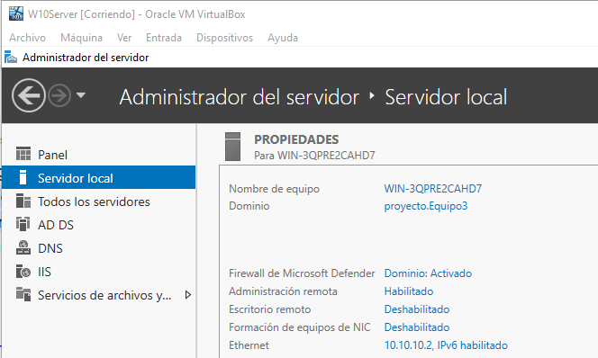
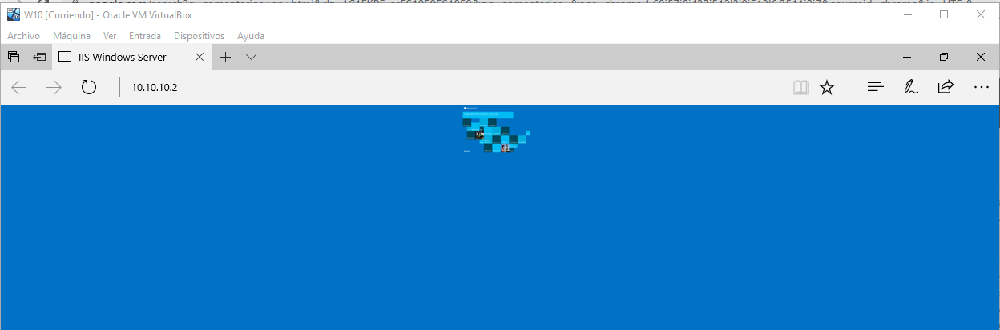
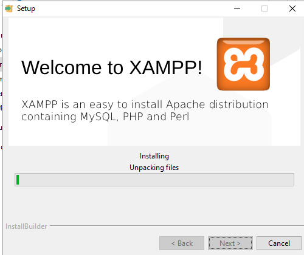
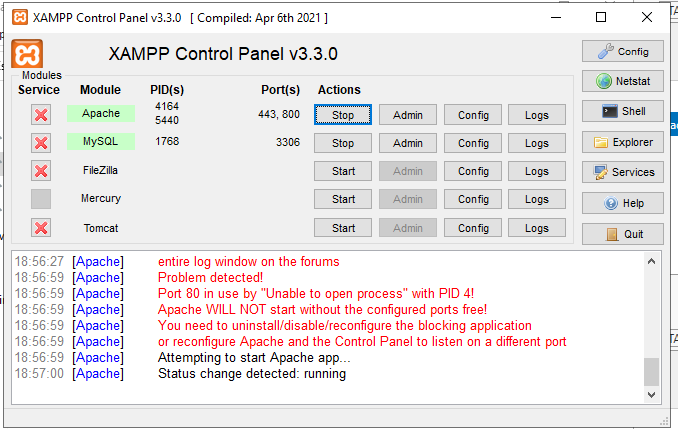

# Servidor
He instralado y configurado el servidor y le he conectado la maquina virtual windows 10.

Esta es la configuracion del servidor.

He descargado el IIS de windows y asi es como se ve la pagina desde la maquina de windows 10
despues de hacer unaos cambios a modo de comprobacion.

He descargado ademas xampp para poder manejar la base de datos desde el servidor

