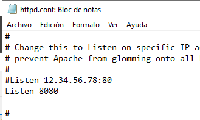
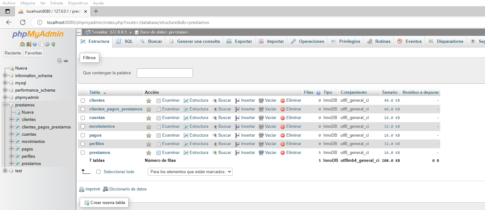
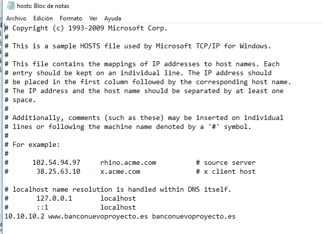

# Servidor
He instralado y configurado el servidor y le he conectado la maquina virtual windows 10.

Al servidor le aplique la direccion ipv4 10.10.10.2 con la mascara de subred 255.255.255.0 y a la maquina de windows 10 la ipv4 10.10.10.3 y le he puesto en el DNS la ip del servidor. Ademas he descargado el servicio de administracion Active directory.

He descargado ademas xampp para poder manejar la base de datos desde desde phpmyadmin en el servidor y alojar la pagina web mediante apache.

Durante la configuración de XAMPP tuve problemas con la asignación de puertos. Windows Server tenía protegido el puerto 80, así que para acceder a la página web hay que utilizar el puerto 8080. Para ello estuve cambiando cosas en los archivos de configuración y cambiar el puerto por defecto de apache en la configuracion general de xampp.

Se ha importado la base de datos en el servidor haciendo uso del script de creacion de la base de datos, para ello se tubieron que cambiar en los collates la codificacion utf8mb4_0900_ai_ci por utf8mb4_general_ci.

Para poder acceder la pagina web desde la maquina windows 10 he abilitado en ambas maquinas una excepcion en firewall al puerto 8080, para poder acceder a la base de datos hice lo mismo con el puerto 3306

Tambien he añadido en el archivo hosts de la maquina virtual windows 10 un nombre relacionado con la ip del servidor.

[Readme](README.md)
