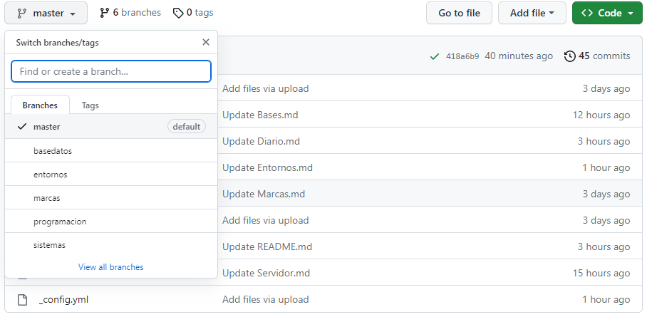
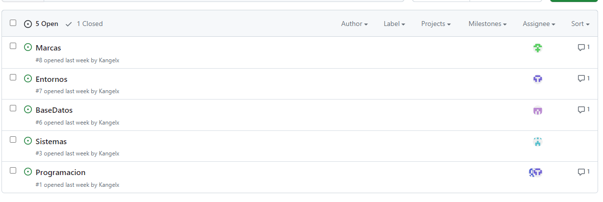
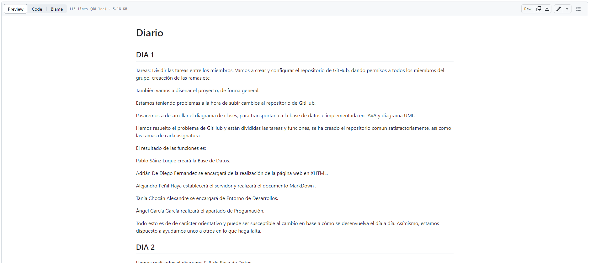
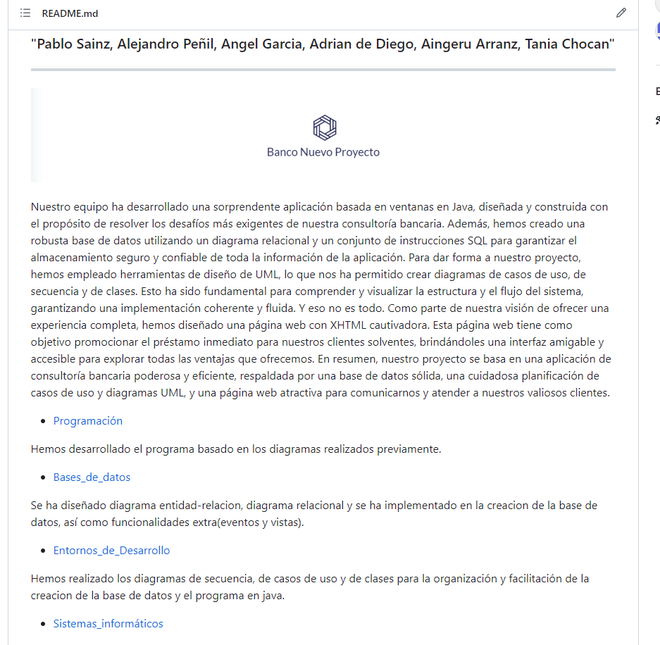

# Proyecto intermodular Organización del proyecto "Banco Nuevo Proyecto"  

***

Para la organización del trabajo ha sido fundamental la herramienta de Github. Nuestro proyecto comenzó con la creación del repositorio mediante el cual nos comunicaríamos los 6, utilizándolo para enviarnos las distintas versiones de nuestras ramas en el trabajo.
Para mayor orden quisimos crear una rama por cada parte del proyecto coincidiendo con cada módulo que debíamos desarrollar, y designar un encargado de ella.

Aunque todos hemos colaborado en cada una de las ramas, el encargado de cada una se ocuparía de reunir el trabajo relativo a cada módulo del proyecto, revisarlo y subirlo a git, de forma que todos pudiésemos acceder a ello sin problemas de versiones.
Para una correcta comunicación y corrección de errores creamos también un issue correspondiente a cada rama, de modo que los errores detectados por cualquiera de los integrantes del grupo al igual que las posibles correcciones y cambios quedasen reflejados como tareas o actividades pendientes.

Además de esto Git nos ha servido para documentar día a día nuestro proyecto, comparar y analizar cómo estábamos repartiéndonos las tareas y percatarnos de si necesitábamos cambiar nuestra organización o nuestra manera de abordar los retos que iban apareciendo. Cada uno de los días nos hemos reunido a primera hora para hacer una recopilación de lo avanzado en casa, y planear a qué íbamos a dedicar la jornada de ese día, de esta forma podíamos fijarnos objetivos claros y comprobar cuánto era el tiempo de media que utilizábamos en cada uno de ellos.

El diario ha sido una parte fundamental, y por eso lo dejamos recogido junto al resto de la documentación en la página inicial del proyecto, en el README, donde junto a este registro fuimos añadiendo poco a poco más información de las diferentes ramas, organizadas en un documento de markdown por cada una, que adjuntase tanto los fragmentos de código relevantes para entender nuestro camino en el desarrollo del proyecto como las capturas necesarias para dejar documentado ciertos apartados gráficos.

