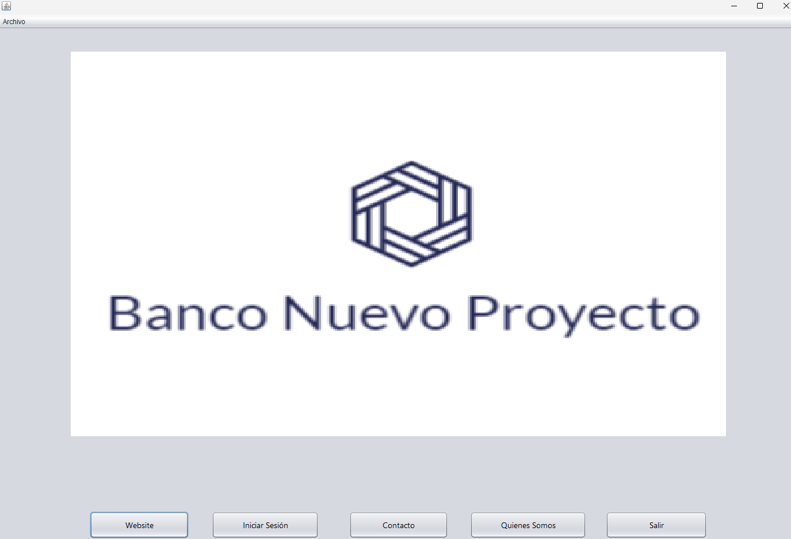
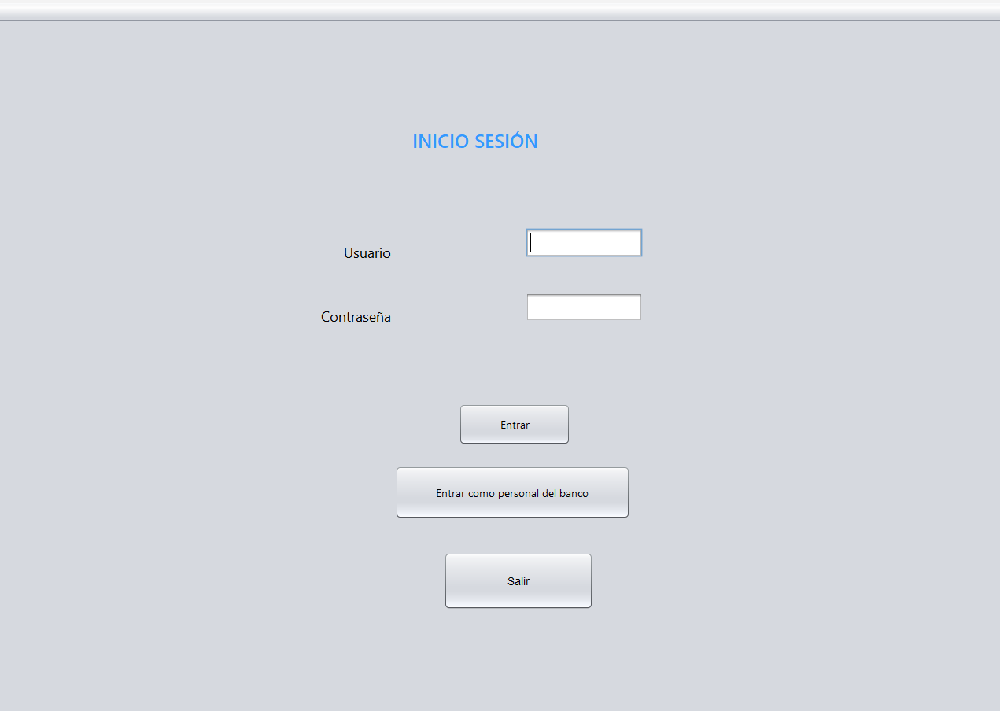
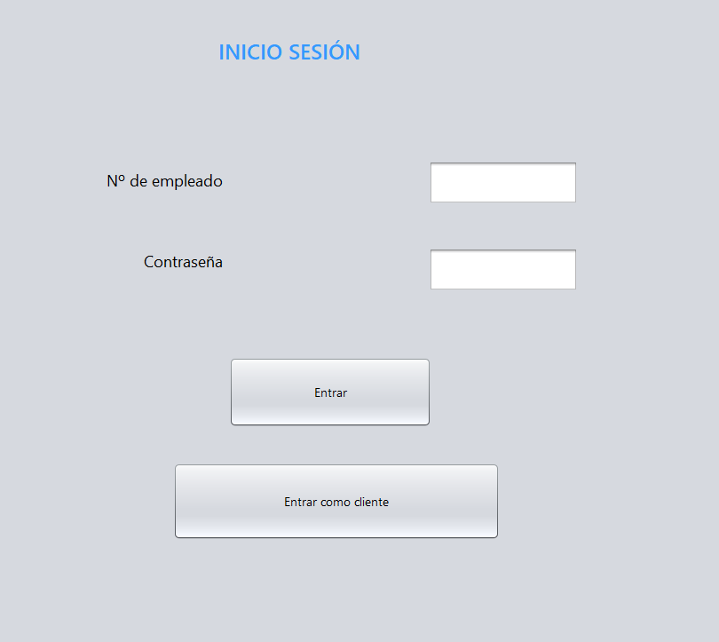
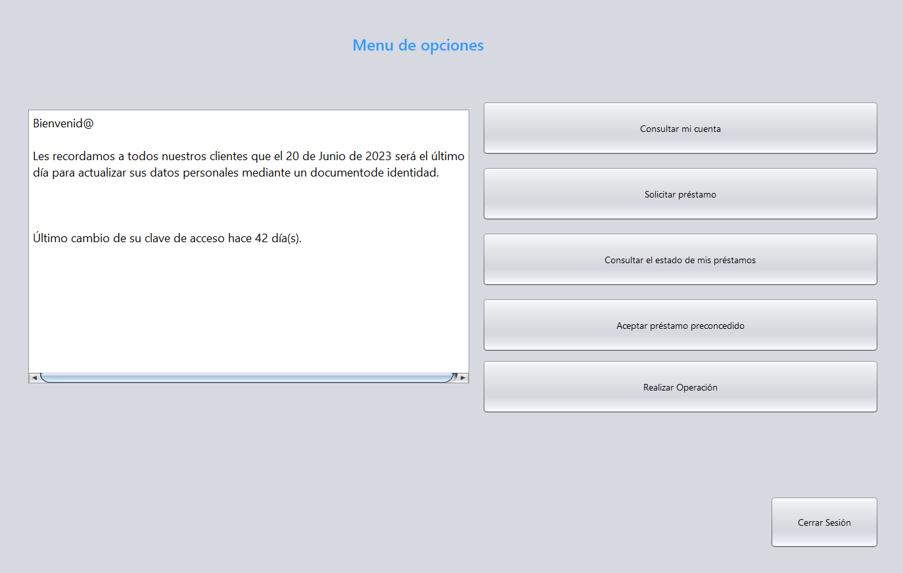
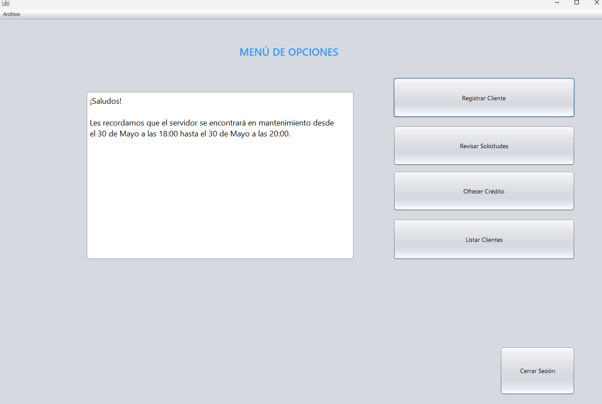
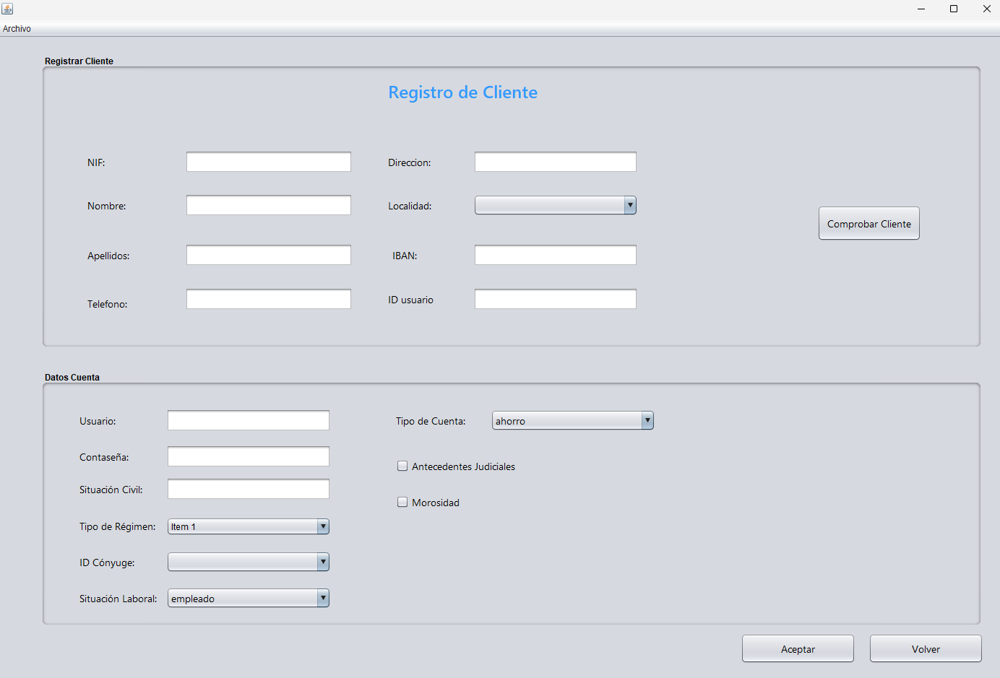
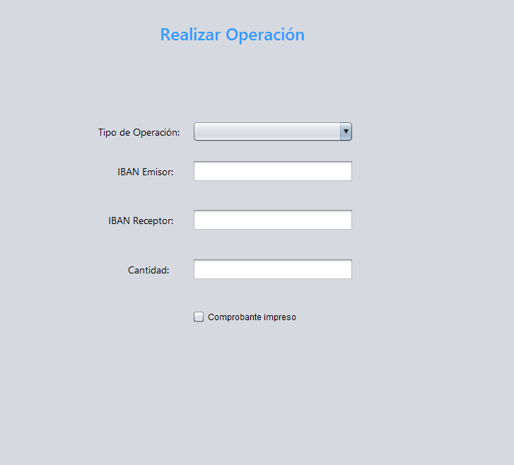

# Proyecto intermodular Aplicación Java "Banco Nuevo Proyecto"  

***

Antes de nada, hemos realizado la jerarquia de clases a partir de la base de datos para crear la estructura y trabajar luego sobre ella. Para cada tabla en la base de datos, hay dos clases, una contiene todos los parametros de la tabla y otra realiza las consultas contra la base de datos sobre esta.  
Cada tabla tiene un método para identificarse utilizando mapas, gestionado con una interfaz implementada en las clases base y sus respectivos metodos para conectar con la base de datos:


``` java
    public LinkedHashMap<String, String> datosObjeto() {
        LinkedHashMap<String, String> datos = new LinkedHashMap();
        DateTimeFormatter formato = DateTimeFormatter.ofPattern("dd-MM-yyyy");
        datos.put("uuid", uuid);
        datos.put("dni", dni);
        datos.put("nombre", nombre);
        datos.put("apellidos", apellidos);
        datos.put("telefono", telefono);
        datos.put("direccion", direccion);
        datos.put("localidad", localidad);
        datos.put("fechaNac", fechaNac.format(formato));
        datos.put("iban", iban);
        return datos;
    }
```

Tambien hemos tenido que crear una clase para gestionar los enumerados, para transformarlos de string a enumerado al hacer consultas:
 

 ``` java
public static SitCivil transSitCivil(String entrada){
        SitCivil salida=null;
        if (entrada.equalsIgnoreCase("casado")){
            salida = SitCivil.CASADO;
        }else if(entrada.equalsIgnoreCase("soltero")){
            salida = SitCivil.SOLTERO;
        }else{
            salida = SitCivil.VIUDO;
        }
        
        return salida;
    }
```

Los enumerados los hemos creado por clases, para tener un mayor orden:

``` java
public enum SitLaboral {
   EMPLEADO, DESEMPLEADO,AUTONOMO, RENTISTA, PENSIONISTA, ESTUDIANTE, RESPONSABLE_DEL_HOGAR
}
```
La interfaz repositorio la hemos utilizado de base para crear las funciones hacia la base de datos, y la implementan las clases que usan los metodos que contiene. Hemos tenido que quitar el metodo listar, ya que solo lo usa una clase.

``` java
public interface Repositorio<T> {

    public T porId(String id);

    public boolean guardar(T t);

    public boolean eliminar(String id);
}
    
```

Por último, hemos creado la clase MetodosAplicacion, que son los metodos que va a usar la aplicacion directamente para realizar cada accion o operacion, como registrar un usuario: 
 
``` java
public static boolean registrarUsuario(Clientes c, Perfiles p, Cuentas cu) {
        boolean acabado = true;
        FuncionesClientes clientes = new FuncionesClientes();
        FuncionesPerfiles perfiles = new FuncionesPerfiles();
        FuncionesCuentas cuentas = new FuncionesCuentas();
        if (!clientes.guardar(c) || !perfiles.guardar(p) || !cuentas.guardar(cu)) {
            acabado = false; //si no se realiza el guardado de clientes, perfiles o cuentas, devuelve falso el metodo
        }
        return acabado;
    }
```
o calcular el préstamo que se le puede ofrecer a un cliente a partir de los datos que alberga la base sobre él

``` java
    private static double calculoPrestamo(Cuentas cuenta) {
        //margen de prestamo 1
        final double minPrestamo1 = 1000;
        final double maxPrestamo1 = 2000;
        final double prestamo1 = 5000;
        // margen de prestamo 2
        final double minPrestamo2 = 2000;
        final double maxPrestamo2 = 3000;
        final double prestamo2 = 10000;
        // prestamo 3 i es mayor que el prestamo 2
        final double prestamo3 = 15000;
        double prestamo = 0;
        if (cuenta.getNominaMedAnual() > minPrestamo1 && cuenta.getNominaMedAnual() < 
        maxPrestamo1 && cuenta.getNominaUltimo() > minPrestamo1 && cuenta.getNominaUltimo() <     maxPrestamo1) {
            prestamo = prestamo1;
        } else if (cuenta.getNominaMedAnual() > minPrestamo2 && cuenta.getNominaMedAnual() < 
        maxPrestamo2 && cuenta.getNominaUltimo() > minPrestamo1 && cuenta.getNominaUltimo() < maxPrestamo2) {
            prestamo = prestamo2;
        } else {
            prestamo = prestamo3;
        }
        return prestamo;
    }

    ```

    Respecto a la propia aplicación y a sus ventanas, su diseño es sencillo pero funcional. Comenzamos con una ventana de inicio que nos muestra el logo del banco y las diferentes 
    opciones de contacto, inicio de sesión, historia del banco, website (no habilitado puesto que no hemos conectado la aplicación a la página web) y un botón sencillo de salida que 
    nos permite cerrar la aplicación.

    

    Aquí adjunto uno de los métodos principales para esta distribución, el que refleja la imagen principal.

    ```java
    private void mostrarImagen() {
        ImageIcon img = new ImageIcon(getClass().getClassLoader().getResource("Imagen/logocor.png"));
        Icon icon = new ImageIcon(img.getImage().
                getScaledInstance(lblIcono.getWidth(),
                        lblIcono.getHeight(), img.getIconWidth()));
        lblIcono.setIcon(icon);
    }
    ```

    Los menus de inicio de sesión mantienen esa misma sencillez, pero eficacia. Tenemos dos pantallas entre las que se puede navegar, la de inicio de sesión del usuario y la del banquero o administrador que tendrá el acceso a modificar la base de datos con nuevos clientes y demás.




Ambos inicios de sesión corresponden respectivamente a un espacio de área personal con opciones para cada tipo de usuario, junto a un mensaje informativo con novedades o noticias de interés.




La mayoría de los botones que nos ofrece la interfaz del área personal de cada uno nos llevan a ejecutar métodos ya definidos en el código que dan como resultado la muestra por pantalla de datos de algún tipo seleccionado, la inserción de nuevos clientes o préstamos en la base de datos, o la modificación de algunos datos concretos en ciertas tablas

Por ejemplo, aquí tenemos parte del código que se encarga de gestionar el método de consultar el estado de su cuenta por parte de un cliente:

```java
        DefaultTableModel modelo = (DefaultTableModel) jTableClientes2.getModel();
        FuncionesCuentas funcCuenta = new FuncionesCuentas();
        FuncionesClientes funcCliente = new FuncionesClientes();
        Object[] prueba = new Object[5];

        String uuid = MetodosAplicacion.leeUuid();
        String ibanCliente = funcCliente.porId(uuid).getIban();
        Cuentas cuenta = funcCuenta.porId(ibanCliente);
        if (cuenta != null) {
            prueba[0] = cuenta.getIban();
            prueba[1] = cuenta.getTipoCuenta().name();
            prueba[2] = cuenta.getSaldo();
            prueba[3] = cuenta.getNominaUltimo();
            prueba[4] = cuenta.getNominaMedAnual();

            modelo.addRow(prueba);

            jTableClientes2.setModel(modelo);
        }

```
Hemos programado también en ciertas partes de los métodos la aparición de una ventana emergente de error en los casos en los que la entrada de datos no sea la esperada, adjunto el ejemplo del método para realizar una operación por parte del cliente:

```java
private void btnAceptarOperacionActionPerformed(java.awt.event.ActionEvent evt) {                                                    
        // BOTON DE ACEPTAR OPERACION DE USUARIO

        String opcion = comboOperacion.getSelectedItem().toString();
        String uuid = MetodosAplicacion.leeUuid();
        if (txtApellido1.getText() == null || txtIBAN1.getText() == null) {
            JOptionPane.showMessageDialog(null, "No se han introducido los datos requeridos");
        } else {
            if (opcion.equalsIgnoreCase("Transferencia")) {
                if (MetodosAplicacion.porIban(txtDireccionReg1.getText()).getUuid().equalsIgnoreCase(uuid)) {
                    MetodosAplicacion.transferencia(MetodosAplicacion.porIban(txtDireccionReg1.getText()).getUuid(), MetodosAplicacion.porIban(txtApellido1.getText()).getUuid(), Double.parseDouble(txtIBAN1.getText()));//transferencia del emisor al receptor con la cantidad
                }else{
                    JOptionPane.showMessageDialog(null, "El iban del emisor no coincide con el usuario que esta pidiendo la transferencia");
                }
            } else if (opcion.equalsIgnoreCase("Ingreso")) {
                MetodosAplicacion.ingresar(MetodosAplicacion.porIban(txtApellido1.getText()).getUuid(), Double.parseDouble(txtIBAN1.getText()));
            } else {
                MetodosAplicacion.retirar(MetodosAplicacion.porIban(txtApellido1.getText()).getUuid(), Double.parseDouble(txtIBAN1.getText()));
            }
        }


    } 
```

Junto a los métodos que nos devuelven tablas o listas, encontramos también las ventanas que nos presentan los campos necesarios para insertar en ciertas tablas una fila nueva en forma de formulario, como es el caso del registro de un nuevo cliente por parte del banquero.



o el trámite de realizar una operación, ya sea de transferencia, ingreso o retirada de efectivo.


